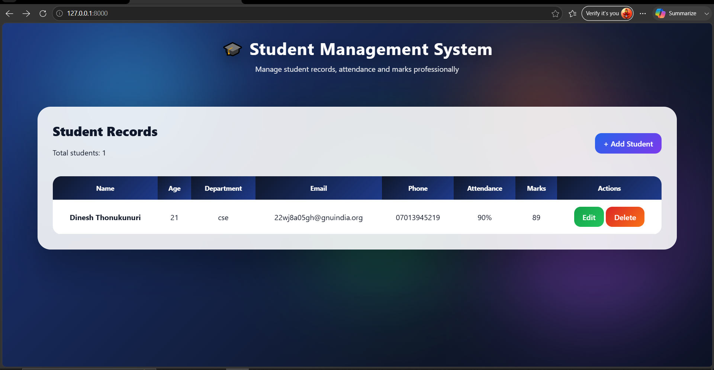
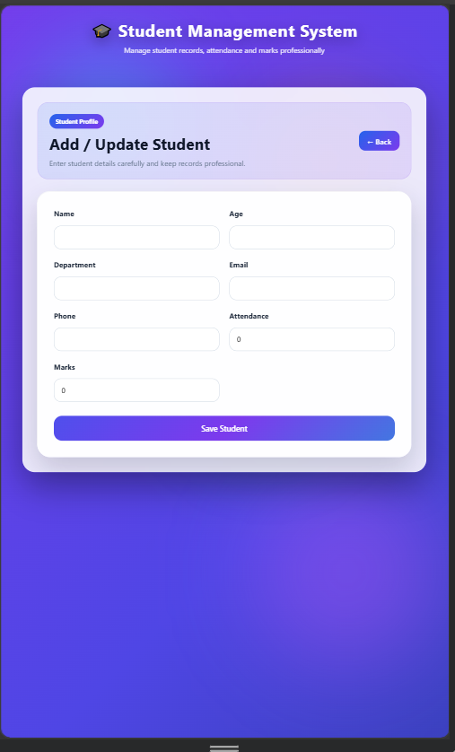

# 🎓 Student Management System

A modern and visually appealing Student Management System built using Django. The application provides complete CRUD functionality for managing student records, attendance, marks, and department details through a premium dashboard interface.

---

## 🚀 Features

✅ Add Student Records

✅ Update Student Information

✅ Delete Student Records

✅ Attendance Tracking

✅ Marks Management

✅ Responsive Design

✅ Glassmorphism UI

✅ Animated Background Effects

✅ Modern Dashboard

---

## 🛠️ Technology Stack

* Python
* Django
* SQLite
* HTML5
* CSS3
* JavaScript

---

## 📸 Project Screenshots

### Dashboard

### Mobile Responsive View

---

## 📂 Project Structure

student_management/

├── manage.py

├── student_management/

├── students/

├── templates/

├── screenshots/

└── README.md

---

## ⚙️ Installation

Clone the repository:

git clone https://github.com/thonukunuridinesh-eng/student-management-system.git

Navigate to project folder:

cd student-management-system

Install dependencies:

pip install django

Run migrations:

python manage.py makemigrations

python manage.py migrate

Start server:

python manage.py runserver

Open:

http://127.0.0.1:8000/

---

## 🎯 Learning Outcomes

* Django CRUD Operations
* Database Management
* Template Rendering
* Responsive UI Design
* Animation Integration
* MVC Architecture

---

## 👨‍💻 Author

Dinesh Thonukunuri

B.Tech CSE Student

Python Full Stack Developer

GitHub: https://github.com/thonukunuridinesh-eng
